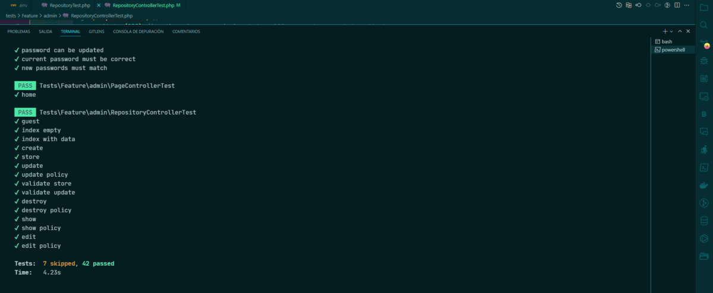

<div align="center">

<h1>CRUD TESTING TDD | LARAVEL </h1>

[]()
[](https://github.com/kylelobo/The-Documentation-Compendium/issues)
[](https://github.com/kylelobo/The-Documentation-Compendium/pulls)
[](/LICENSE)

## 💬 Descripción del proyecto <a name="point_right-descripción-del-proyecto-"></a>

<p>Proyecto de Testing con Laravel que utiliza pruebas automatizadas para validar el correcto funcionamiento de los componentes de la aplicación. Se han utilizado herramientas de testing de Laravel y se pueden ejecutar las pruebas con el comando "php artisan test".

## 🥇 DEMO 🥇 <a name="-demo--"></a>

</p>
</div>

<div align="center">
<p align="center">
  <a href="" rel="noopener">
 </a>
</p>
</div>

---

<h2> 📝 Tabla de contenido </h2>

- [💬 Descripción del proyecto ](#-descripción-del-proyecto-)
- [🥇 DEMO 🥇 ](#-demo--)
- [💎 Tecnologías utilizados](#-tecnologías-utilizados)
  - [📖 Características ](#-características-)
  - [✒️ Clonar ](#️-clonar-)
  - [⌨️ Uso ](#️-uso-)
- [👨‍💻 Desarrollador](#-desarrollador)

## 💎 Tecnologías utilizados<a name="beginner-tecnologías-utilizados"></a>

-   Este proyecto utiliza las siguientes tecnologías:

-   **Laravel** - un framework de PHP para aplicaciones web
-   **Tailwind CSS** - un framework de CSS para diseñar interfaces de usuario
-   **Alpine.js** - un framework de JavaScript para la capa de presentación
-   **Livewire** - una biblioteca de componentes para Laravel que permite construir interfaces de usuario dinámicas sin tener que escribir JavaScript

### 📖 Características <a name="dart-prerrequisitos-"></a>

Este proyecto incluye las siguientes características:

-   Operaciones CRUD (Crear, Leer, Actualizar y Eliminar) en una base de datos utilizando una testing TDD
-   Prueba de testing

### ✒️ Clonar <a name="-clonar-"></a>

Clonar para usarlo en tu servidor local

```
git@github.com:cybertcode/TDDPlatzyLaravel.git
```

ó

```
https://github.com/cybertcode/TDDPlatzyLaravel.git
```

### ⌨️ Uso <a name="-uso-"></a>

-   En el terminal

    ```
    composer install
    cp .env.example .env
    php artisan key:generate
    ```

-   Crear tu base de datos
-   Cambiar los datos de usuario

    ```
    DB_DATABASE=testing
    DB_USERNAME=root
    DB_PASSWORD=
    ```

-   En el terminal
    ```
    php artisan migrate
    php artisan db:seed
    php artisan serve
    ```
-   Ver funcionamiento
    ```
    http://127.0.0.1:8000
    ```
    -   Registrarte para acceder
    ```
    http://127.0.0.1:8000/register
    ```

## 👨‍💻 Desarrollador<a name="desarrollador"></a>

<div  align="center">

[](https://github.com/cybertcode)

[](https://github.com/cybertcode)

<p align="center">
   Mis redes sociales :<br/><br/>
    <a href="https://www.linkedin.com/in/marvyn-kevyn-huanca-hilario-a12699b7/"></a>
    <a href="https://www.facebook.com/profile.php?id=100047330599374"></a>
    <a href="https://gitlab.com/cybert22"></a>
    <a href="https://www.instagram.com/mkevynhh"></a>
    <a href="https://www.twitch.tv/cybert22"></a>
    <a href="https://twitter.com/Kevyn94"></a>
</p>

</div>

---

</br>
<div align="center">
<p align="center"> © 2023 Cybertcode, todos los derechos Reservados. Hecho con mucho ❤️ . </p>
<p align="center">
https://www.cybertcode.com
</p>
</div>
